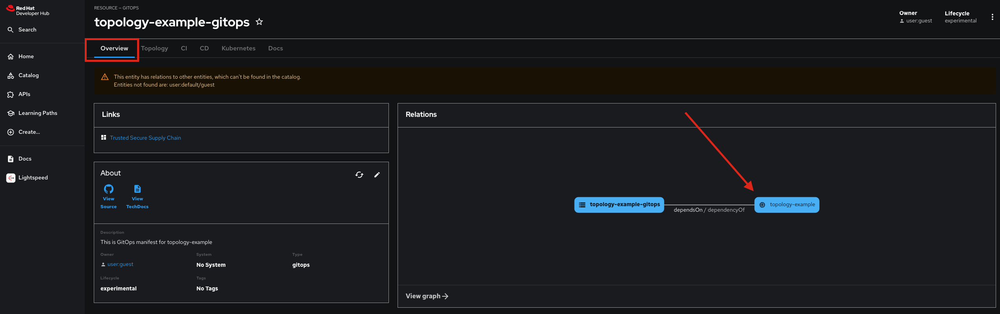

# Agentic AI Framework Template Gitops

This repository contains the necessary content required for managing GitOps. It was created as part of an Agentic AI Framework Template. The associated source component is available for reference in the **Overview** tab. You can find an example of this reference in the following image.

# Deployed Resources

Based on the input from the Agentic AI Framework Template, a deployment with the following characterisics was made:

# Application

An application built from https://github.com/fpetk-rolling-demo/test-crewai25102101 will be stored in [quay.io/tpetkos/test-crewai25102101](https://quay.io/tpetkos/test-crewai25102101) and deployed through GitOps. This application is accessible on port **8501\*\*.
